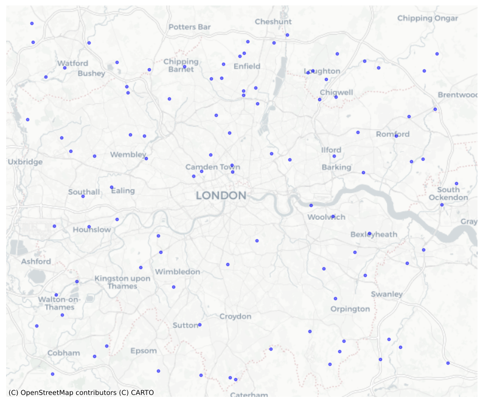

---
### Required
title: A post rendered from a Jupyter notebook (.ipynb)
date: 2025-05-02
authors: # names must match names in content/authors for correct linkage
- Beatrice Taylor
- Claude Lynch
summary: The summary that will show up in the preview card
draft: false
featured: true

### Optional
tags:
- Housing
- Urban Planning

# If the post is linked to any project under content/project/, add the folder's name(s), e.g. ['ai4ci','ntem']. Otherwise, leave blank.
projects: ['ai4ci'] 

# Add collaterals which will show up as clickable buttons on the post
url_code: ''
url_pdf: ''
url_slides: ''
url_video: ''
---

<details>
<summary>Code</summary>

``` python
import pandas as pd
import geopandas as gpd
import numpy as np
import matplotlib.pyplot as plt
import contextily as ctx

# Generate random data points mimicking location data in London
num_points = 100
lats = np.random.uniform(51.30, 51.70, num_points)
lons = np.random.uniform(-0.5, 0.3, num_points)
data = pd.DataFrame({'latitude': lats, 'longitude': lons})
gdf = gpd.GeoDataFrame(data, geometry=gpd.points_from_xy(data.longitude, data.latitude), crs='EPSG:4326')
gdf = gdf.to_crs(epsg=3857)
# Plot the data points on a map
fig, ax = plt.subplots(figsize=(10, 10))
gdf.plot(ax=ax, color='blue', alpha=0.5, markersize=10)
ctx.add_basemap(ax, source=ctx.providers.CartoDB.Positron)
ax.set_axis_off()
plt.show()
```

</details>


